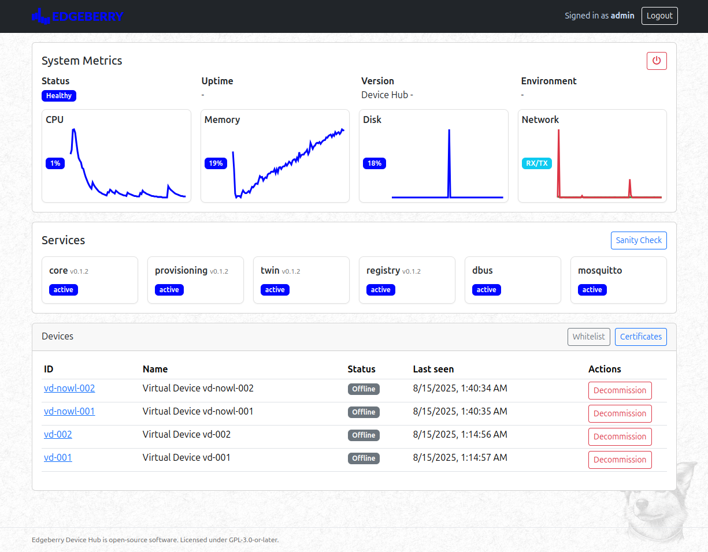

**A self-hostable device management service for Edgeberry devices.**

**Edgeberry Device Hub** is the single control plane for your Edgeberry fleet — a dashboard and API to onboard devices, manage their digital twins, and observe the system in real time.

**Keep your data private** • **Add devices instantly** • **Stay secure by default** • **Monitor your fleet** • **Control remotely** • **Troubleshoot easily** • **Integrate anywhere** • **Run offline** • **Scale as needed**

 

## Services
Microservice architecture seperates the responsibilities. Each service is a separate process that communicates with the others via D-Bus.

- **Core Service**
  - The main entry point that serves the web dashboard and handles all HTTP requests. Think of it as the "front desk" that coordinates everything behind the scenes.
  - Manages user authentication, system configuration, and provides the REST API that powers the web interface.
  - Owns the public D-Bus name `io.edgeberry.devicehub.Core` and exposes Core D-Bus interfaces (Whitelist, Certificate, Twin) to internal workers and tools.
  - Proxies device twin operations to `twin-service` over D-Bus so there is a single public API surface.
  - Owns device registry/inventory data and exposes the public HTTP endpoints for devices. No standalone registry microservice exists.

- **Provisioning Service**
  - Handles device onboarding and security certificates. When a new Edgeberry device wants to join your network, this service validates it and issues the proper credentials.
  - Creates and manages device identities, ensuring only authorized devices can connect to your hub.

- **Device Twin Service**
  - Maintains a "digital twin" for each device - a real-time mirror of its current state and desired configuration.
  - Tracks what you want each device to do (desired state) versus what it's actually doing (reported state), automatically syncing changes between your dashboard and devices.
  - Exposes an internal D-Bus interface `io.edgeberry.devicehub.Twin1` under bus `io.edgeberry.devicehub.Twin` for Core to call. Not directly exposed to external clients.

See `documentation/alignment.md` for architecture and interface details, including D-Bus contracts.

### HTTP API Note (Twin)
- New endpoint in Core: `GET /api/devices/:id/twin` — returns desired/reported docs by calling Twin over D-Bus.

## Internal MQTT (twin-service)

| Topic | Direction | Description |
| --- | --- | --- |
| `$devicehub/certificates/create-from-csr` | Inbound | Create a new certificate from a CSR |
| `$devicehub/certificates/create-from-csr/accepted` | Outbound | Certificate created successfully |
| `$devicehub/certificates/create-from-csr/rejected` | Outbound | Certificate creation failed |
| `$devicehub/devices/{uuid}/provision/request` | Inbound | Request a new device to be provisioned (uuid = whitelist/claim UUID) |
| `$devicehub/devices/{uuid}/provision/accepted` | Outbound | Device has been provisioned |
| `$devicehub/devices/{uuid}/provision/rejected` | Outbound | Device provisioning rejected |
| `$devicehub/devices/{deviceId}/twin/get` | Inbound | Request device twin state (handled by twin-service) |
| `$devicehub/devices/{deviceId}/twin/update` | Inbound | Update device twin state (handled by twin-service) |
| `$devicehub/devices/{deviceId}/twin/update/accepted` | Outbound | Twin update accepted |
| `$devicehub/devices/{deviceId}/twin/update/rejected` | Outbound | Twin update rejected |
| `$devicehub/devices/{deviceId}/twin/update/delta` | Outbound | Twin state delta notification |

Note: Core no longer ingests MQTT directly. All device twin access for external clients goes through Core HTTP/D-Bus.

## License & Collaboration
**Copyright 2025 Sanne 'SpuQ' Santens**. The Edgeberry Device Hub project is licensed under the **[GNU GPLv3](LICENSE.txt)**. The [Rules & Guidelines](https://github.com/Edgeberry/.github/blob/main/brand/Edgeberry_Trademark_Rules_and_Guidelines.md) apply to the usage of the Edgeberry brand.

### Collaboration

If you'd like to contribute to this project, please follow these guidelines:
1. Fork the repository and create your branch from `main`.
2. Make your changes and ensure they adhere to the project's coding style and conventions.
3. Test your changes thoroughly.
4. Ensure your commits are descriptive and well-documented.
5. Open a pull request, describing the changes you've made and the problem or feature they address.