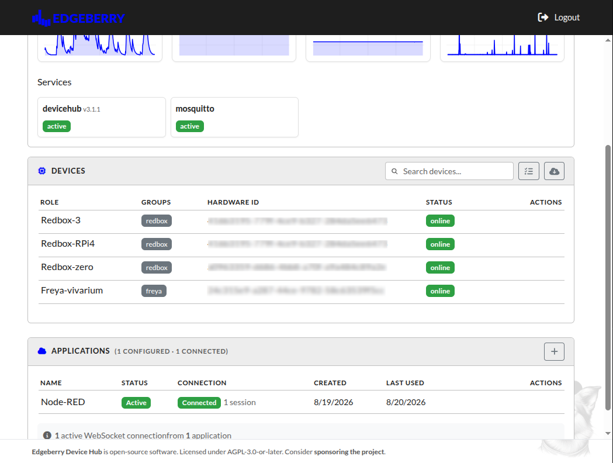

The **Edgeberry Device Hub** is the cloud-side endpoint of the Edgeberry bridge. An [Edgeberry Device](https://github.com/Edgeberry/Edgeberry-device-software) is the only thing on the device side that speaks MQTT; the Hub is the only thing on this side that does. Point a fleet of devices at it and you get mTLS-authenticated connections, per-device digital twins, telemetry, and a REST/WebSocket API for building applications on top — without either side ever having to trust the other beyond a certificate.

It runs as a single process with clearly separated internal modules — not a pile of microservices, not a cloud SaaS dependency. You can run it on a Raspberry Pi in a closet or a small VPS.

## Getting started

```sh
export DEVICEHUB_DOMAIN=devicehub.example.com   # optional, added as a cert SAN
wget -O install.sh https://github.com/Edgeberry/Edgeberry-Device-Hub/releases/latest/download/install.sh
chmod +x install.sh
sudo -E ./install.sh
```

This installs Device Hub, an MQTT broker (Mosquitto, mTLS on 8883) with a fresh Root CA, and a systemd unit. It prompts for an admin password on first run — or set `ADMIN_PASSWORD` beforehand for an unattended install.

Log in at `http://<host>:3000` with that password. From there:

- **Whitelist** the UUIDs of devices you expect to provision (or disable enforcement — see below).
- **Download the claim certificate bundle** from the Certificates page and install it on a device, or point an [Edgeberry Device](https://github.com/Edgeberry/Edgeberry-device-software) at this Hub's hostname and let it fetch one itself.
- Watch the device appear, provision, and start reporting its twin.

Running behind a reverse proxy that already does authentication (nginx `auth_basic`, oauth2-proxy, mTLS)? `sudo devicehub --disable-login` turns off the Hub's own login instead of stacking two auth layers.

### Local development

```sh
npm install && npm run dev     # API on :8080
cd ui && npm install && npm run dev   # UI on :5173, proxies API calls
```

No Mosquitto needed to poke at the admin UI — only the provisioning/twin/application sub-services need a broker to talk to.

## Architecture

Device Hub is one Node.js process, one systemd unit, built from a small number of internal modules rather than a service mesh:

- **Admin HTTP/WS server** (port 3000) — the UI you log into: devices, twins, certificates, whitelist, application tokens, logs.
- **`provisioning`** — the MQTT handshake that turns an unclaimed device into a named, certificate-holding one (below).
- **`twin`** — device digital twins (desired/reported state) and online/offline tracking, over MQTT.
- **`application`** — a REST + WebSocket API on its own port (8090, separate from the admin port so you can expose one without the other) for building dashboards, Node-RED flows, or anything else that needs to read telemetry or send commands.

These talk to each other through plain function calls into a handful of shared store modules (`devices-store`, `twin-store`, `whitelist-store`, `token-store`, `event-store`) backed by one SQLite database — not RPC, not a message queue, not separate processes. The boundary between them is a module boundary, not a network one. Each sub-service keeps its own MQTT connection, matching the topic subscriptions it actually needs.

### Claim-certificate provisioning

A device never ships with an identity Device Hub already trusts — it ships with a **claim certificate**: one fleet-wide client cert, good only for the provisioning handshake, that lets an unclaimed device connect just long enough to get its own certificate.

The handshake is two MQTT round trips on the same connection, distinguished by whether a CSR is attached:

1. **Claim** (`$devicehub/devices/{uuid}/provision/request`, no CSR) — the device connects with its hardware UUID as MQTT client ID. If whitelist enforcement is on, the UUID must already be known to the Hub. A fresh, randomly generated device name is assigned and handed back.
2. **Issue** (same topic, CSR attached, CN'd for that assigned name) — the Hub signs the CSR against its Root CA and returns the device certificate plus chain. The device reconnects using that certificate as its real, ongoing identity — the UUID/claim-cert connection is never reused for anything else.

Whitelist enforcement (`ENFORCE_WHITELIST`, default on) gates step 1 on the UUID being pre-registered; it's not a one-shot lock, so a whitelisted device can reprovision indefinitely — useful for SD-card re-flashes or certificate renewal. Revoking a device's certificate publishes an updated CRL to Mosquitto immediately, no broker restart required.

### Device identity

A device carries three identifiers, and they are not interchangeable. Most confusion about this codebase starts with treating them as one thing.

| | identifies | lifetime | where it appears |
|---|---|---|---|
| **`uuid`** | the physical board (HAT EEPROM) | fixed to the hardware | claim handshake only |
| **`name`** | the wire identity | assigned at provisioning, never mutated | MQTT client ID, certificate CN, twin key |
| **`role`** | the application identity | admin-chosen, repointed on hardware swap | UI, `device_roles` |

**`uuid` is a claim token, not an identity.** That is the whole reason provisioning is two round trips: the UUID gets a device far enough to earn a certificate, and is then never used on the wire again. Anything that puts the UUID back on a hot path is working against that.

**`name` is what the broker and the twin see.** Device rows are never mutated or deleted, so `uuid` ↔ `name` is 1:1 and stable — which is why keying the twin by `name` still means "keyed by the hardware".

**`role` is the only one that moves.** A hardware swap repoints a role's `uuid` at a different device; neither device row changes. The application ID and its groups follow the role. Telemetry and twin history do not — they belong to the hardware that produced them.

#### Which store is keyed by what

`devicehub.db` (registry, certificates, whitelist, roles) is keyed by **`uuid`**. `twin.db` (twin documents, connection events) is keyed by **`name`**, because the twin sub-service reads the device out of the MQTT topic — `$devicehub/devices/{name}/twin/update` — and has nothing else to go on.

So any read that crosses from one to the other resolves first:

```js
const row = db.prepare('SELECT name FROM devices WHERE uuid = ?').get(uuid);
```

This is a join, not a seam: both keys are stable per board. Re-keying the twin by `uuid` would mean a registry lookup on every twin message, on the single synchronous thread that also serves HTTP and MQTT — the exact shape of the outage retention and indexing were added to prevent.

The registry still owns the device's **lifecycle**, though the twin is stored apart from it: decommissioning deletes the twin documents (by both identifiers, so pre-`name` rows go too), the connection events, the role and its groups.

### Digital twin

Standard desired/reported split, MQTT-native (`.../twin/get`, `.../twin/update`, `.../twin/update/{accepted,delta,rejected}`), the same shape whether you get there from a device or from the application API. Presence is derived from heartbeats plus the underlying MQTT connection state, not assumed from twin activity.

#### Reported document layout

Devices running the Edgeberry device software report one top-level key per section:

```jsonc
{
  "system":      { "platform": "...", "state": "running", "version": "3.8.6",
                   "board": "edgeberry", "board_version": "1.6", "uuid": "..." },
  "connection":  { "provision": "disabled", "connection": "connected",
                   "network": "connected", "wifi": "connected" },
  "application": { "state": "...", "health": "ok", "version": "..." },
  "network":     { "medium": "wifi", "interface": "wlan0", "mac": "...",
                   "ipv4": { "address": "...", "prefix": 24, "gateway": "...", "dns": ["..."] },
                   "wifi": { "ssid": "...", "bssid": "...", "channel": 2, "band": "2.4GHz",
                             "strength": 78, "bitrate": 72200, "security": "wpa2" } }
}
```

Reported documents merge **shallowly, one top-level key at a time**, so each section is replaced whole and sections update independently.

`network` is latest-value like everything else in a twin — signal strength is published on change past a deadband, not continuously. For signal over time, use telemetry.

> **Deprecated:** the device software previously published the entire document under the single key `system`, putting the real values at `system.system.version`, `system.connection.wifi` and so on. For one release both resolve — the sections are still nested inside `system` as well — so existing readers keep working. Move to the flat keys; the nested copies will be removed.

## SDKs

Three small TypeScript packages live under [`sdk/`](sdk/), published to npm — one for each side of the Hub, plus one integration built on top. All **MIT-licensed**, separately from the Edgeberry Device Hub itself — see [License & Collaboration](#license--collaboration).

- **[app-client](sdk/app-client/)** (`@edgeberry/devicehub-app-client`) — the *cloud-application* side: talks HTTP/WebSocket to the application API (port 8090) to list devices, subscribe to telemetry, invoke methods, read/write twins. What you'd use to build a dashboard, a Node-RED flow, or any other app that consumes the fleet. Not currently used by any Edgeberry project — it exists for third-party applications to build on.
- **[device-client](sdk/device-client/)** (`@edgeberry/devicehub-device-client`) — the *device* side: speaks raw mTLS MQTT directly to the Hub — provisioning, telemetry, twin sync, direct methods. This isn't just a reference implementation of the protocol: it's the actual library the [Edgeberry Device Software](https://github.com/Edgeberry/Edgeberry-device-software) imports (`EdgeberryDeviceHubClient` in its `deviceHub.ts`) as its live connection to this Hub. Use it directly if you're building a custom device — non-Raspberry-Pi, or one that skips the full Device Software — that still shows up as a first-class device in the Hub.
- **[node-red-contrib](sdk/node-red-contrib/)** (`@edgeberry/devicehub-node-red-contrib`) — a ready-made Node-RED node built on `app-client`, published as its own package rather than kept as sample code.

There's no separate "reach through the Hub to one device" client — an application always goes through the application API; the Hub does the MQTT routing to the actual device internally.

## Production deployment

Reverse proxy (TLS termination, WebSocket passthrough), firewall, and backup guidance lives in [documentation/PRODUCTION_SETUP.md](documentation/PRODUCTION_SETUP.md), with ready-to-copy nginx/systemd config under [documentation/production-server/](documentation/production-server/).

## License & Collaboration

**Copyright 2025 Sanne 'SpuQ' Santens**. The Edgeberry Device Hub server itself is licensed under the **[GNU AGPLv3](LICENSE.txt)** — if you run a modified version as a network service, that modified source must be made available to its users.

Everything under [`sdk/`](sdk/) — [app-client](sdk/app-client/LICENSE), [device-client](sdk/device-client/LICENSE), and [node-red-contrib](sdk/node-red-contrib/LICENSE) — is licensed separately and more permissively, under **MIT**: it's meant to be linked into other people's applications and devices, including closed-source ones, without pulling those projects under the AGPL. Building an application against `app-client`, or a device against `device-client`, does not make that application or device AGPL-licensed.

The [Rules & Guidelines](https://github.com/Edgeberry/.github/blob/main/brand/Edgeberry_Trademark_Rules_and_Guidelines.md) apply to the usage of the Edgeberry brand.

### Collaboration

If you'd like to contribute to this project, please follow these guidelines:
1. Fork the repository and create your branch from `main`.
2. Make your changes and ensure they adhere to the project's coding style and conventions.
3. Test your changes thoroughly.
4. Ensure your commits are descriptive and well-documented.
5. Open a pull request, describing the changes you've made and the problem or feature they address.
