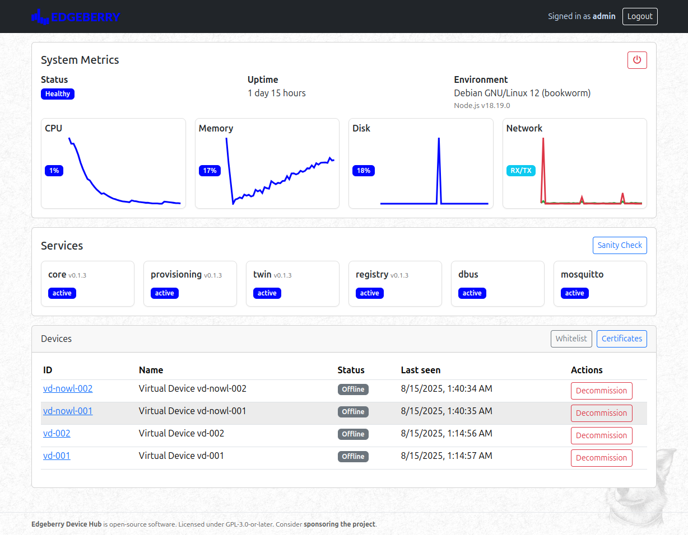

**A self-hostable device management service for Edgeberry devices.**

**Edgeberry Device Hub** is the single control plane for your Edgeberry fleet — a dashboard and API to onboard devices, manage their digital twins, and observe the system in real time.

Use it to:

- **Self-host a single dashboard** to operate your fleet on your own infrastructure (no vendor lock‑in).
- **Onboard devices securely** via MQTT + mTLS with a CSR-based bootstrap flow.
- **Manage certificates** in the UI: generate Root CA, issue provisioning certs, inspect/delete, and download ready-to-use bundles.
- **Maintain a device registry** with identity, status, tags, and last-seen presence.
- **Control digital twins**: read/update desired and reported state, with automatic deltas published to devices.
- **Monitor health and services**: view systemd unit status, version, and service logs (snapshot and live stream) from the dashboard.
- **Use a clean HTTP API and WebSocket** for automation and integrations; the Web UI consumes the same public endpoints.
- **Run lightweight and offline-friendly**: Node.js + SQLite, designed for small hosts; ships as `systemd` services.
- **Extend easily** with modular microservices while keeping a single public surface (`/` UI and `/api/*`).

 

## Services
Microservice architecture seperates the responsibilities. Each service is a separate process that communicates with the others via D-Bus.

- **Core Service**
  - The main entry point that serves the web dashboard and handles all HTTP requests. Think of it as the "front desk" that coordinates everything behind the scenes.
  - Manages user authentication, system configuration, and provides the REST API that powers the web interface.

- **Provisioning Service**
  - Handles device onboarding and security certificates. When a new Edgeberry device wants to join your network, this service validates it and issues the proper credentials.
  - Creates and manages device identities, ensuring only authorized devices can connect to your hub.

- **Device Twin Service**
  - Maintains a "digital twin" for each device - a real-time mirror of its current state and desired configuration.
  - Tracks what you want each device to do (desired state) versus what it's actually doing (reported state), automatically syncing changes between your dashboard and devices.

- **Device Registry Service**
  - Your device inventory system that keeps track of all connected Edgeberry devices. Like a phonebook for your IoT fleet.
  - Records device information, connection history, and operational status so you always know what's connected and when it was last seen.

See `documentation/alignment.md` for architecture and interface details.

## MQTT API

| Topic | Direction | Description |
| --- | --- | --- |
| `$devicehub/certificates/create-from-csr` | Inbound | Create a new certificate from a CSR |
| `$devicehub/certificates/create-from-csr/accepted` | Outbound | Certificate created successfully |
| `$devicehub/certificates/create-from-csr/rejected` | Outbound | Certificate creation failed |
| `$devicehub/devices/{deviceId}/provision/request` | Inbound | Request a new device to be provisioned |
| `$devicehub/devices/{deviceId}/provision/accepted` | Outbound | Device has been provisioned |
| `$devicehub/devices/{deviceId}/provision/rejected` | Outbound | Device provisioning rejected |
| `$devicehub/devices/{deviceId}/twin/get` | Inbound | Request device twin state |
| `$devicehub/devices/{deviceId}/twin/update` | Inbound | Update device twin state |
| `$devicehub/devices/{deviceId}/twin/update/accepted` | Outbound | Twin update accepted |
| `$devicehub/devices/{deviceId}/twin/update/rejected` | Outbound | Twin update rejected |
| `$devicehub/devices/{deviceId}/twin/update/delta` | Outbound | Twin state delta notification |

## License & Collaboration
**Copyright 2025 Sanne 'SpuQ' Santens**. The Edgeberry Device Hub project is licensed under the **[GNU GPLv3](LICENSE.txt)**. The [Rules & Guidelines](https://github.com/Edgeberry/.github/blob/main/brand/Edgeberry_Trademark_Rules_and_Guidelines.md) apply to the usage of the Edgeberry brand.

### Collaboration

If you'd like to contribute to this project, please follow these guidelines:
1. Fork the repository and create your branch from `main`.
2. Make your changes and ensure they adhere to the project's coding style and conventions.
3. Test your changes thoroughly.
4. Ensure your commits are descriptive and well-documented.
5. Open a pull request, describing the changes you've made and the problem or feature they address.